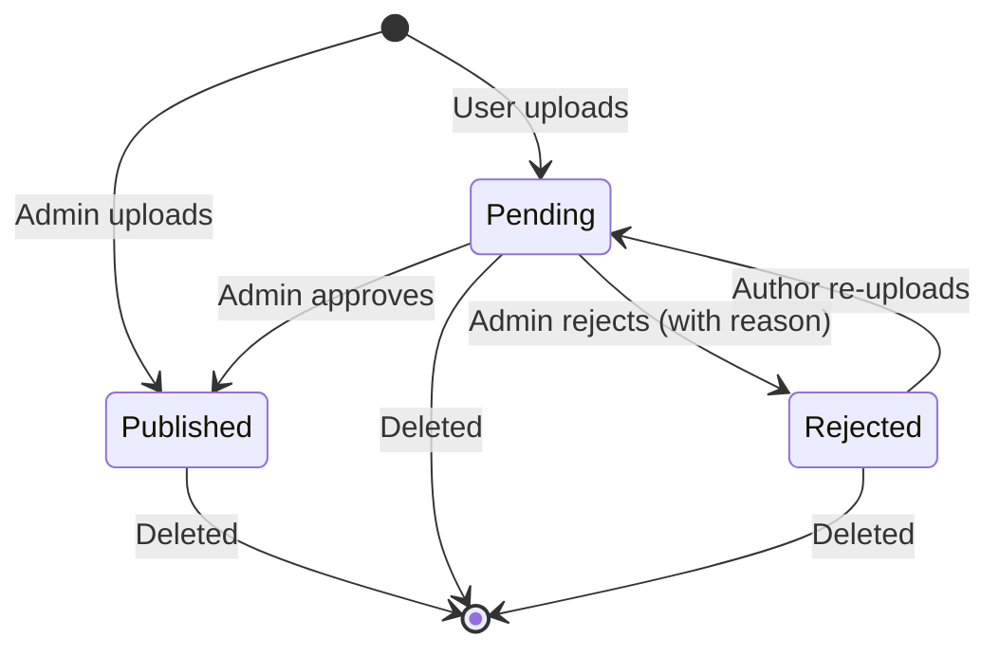

# OpenSkill

English | [中文](./README.zh-CN.md)

A self-hosted hub for **[Anthropic Agent Skills](https://docs.claude.com/en/api/agent-sdk/skills)**.
Upload, review, subscribe, download and preview skill packages from one web app —
with role-based access (admin / user) and durable, bind-mounted data storage.


## What you get

- **Catalog** with full-text search, category filter, tag chips, sort by newest /
  most subscribed / most downloaded
- **Skill detail page** with five tabs: **Overview** (install commands), **Preview**
  (live SKILL.md rendering), **Files** (collapsible tree), **Frontmatter** (raw JSON),
  and **Run** (server-side execution → file download)
- **Upload pipeline** that validates ZIP structure, extracts SKILL.md frontmatter
  (name + description required), parses optional `manifest.json`, computes SHA-256
- **Two-tier review workflow**: admin uploads publish immediately; user uploads
  enter a review queue with approve / reject (with reason) actions
- **Subscriptions + downloads** with cached counts and per-user history
- **Run skill in browser** — for skills containing `scripts/run.js` (Node) or
  `scripts/run.py` (Python), click **Run** to execute server-side and have
  the produced file (.xlsx / .docx / .pdf / …) streamed back as a download.
  Node runtime ships with `docx` + `exceljs`; Python runtime ships with
  `pandas` + `openpyxl` + `python-docx` + `pdfplumber` + `Pillow` + `lxml`
- **Agent mode** — Anthropic-style declarative skills (just `SKILL.md` + assets,
  no entry script) are auto-detected; the LLM gets a `run_python_code` tool
  that executes Python 3 against the unzipped bundle. The user sees the
  produced file as a real downloadable artifact in the chat
- **Chat with skills + tool calling** — talk to an LLM (any OpenAI-compatible
  endpoint, DeepSeek by default) and it can _actually_ call attached runnable
  skills via tool calling; the produced files become real downloadable
  artifacts in the message bubble (no more hallucinated `artifacts/`)
- **Admin tools**: review queue, categories & tags CRUD, users list, stats dashboard
- **One-shot Docker deploy** with bind-mounted persistent data

## Stack

| Layer | Choice |
|---|---|
| Backend | Fastify 5 + better-sqlite3 (WAL mode, single file DB) |
| Frontend | React 19 + Vite 8 + TypeScript + TailwindCSS + Zustand + TanStack Query |
| Auth | JWT (`@fastify/jwt`) + bcrypt |
| Skill format | [Anthropic Agent Skills](https://docs.claude.com/en/api/agent-sdk/skills): root `SKILL.md` + optional `scripts/` `references/` `assets/`, packed as ZIP |
| Tests | `node:test` (built-in), 74 backend tests covering auth, validation, catalog, Node + Python skill execution, chat tool-calling (`run_skill` and agent-mode `run_python_code`), etc. |

## Quick start (Docker)

```bash
git clone <this-repo> openskill
cd openskill
cp .env.example .env
# edit .env: set JWT_SECRET (32+ random chars) and ADMIN_INITIAL_PASSWORD

docker compose -f docker-compose.deploy.yml up -d --build
# open http://<host>:8088
```

The first start auto-creates `./data/openskill.db`, applies all migrations, and
seeds the initial admin (`admin` / your `ADMIN_INITIAL_PASSWORD`).

## Local development

Requires Node.js 20+.

```bash
# install
npm install
npm install --prefix server
npm install --prefix frontend

cp server/.env.example server/.env

# in two terminals (or use the root `npm run dev`)
cd server && npm run dev          # API on :3000
cd frontend && npm run dev        # SPA on :5173 (proxies /api -> :3000)

# run all tests
npm test
```

> If port 3000 is already in use, run the server with `PORT=3010` and update
> `frontend/vite.config.ts` proxy target.

## Configuration

`./.env` (root, used by docker-compose):

| Var | Default | Notes |
|---|---|---|
| `HOST_PORT` | `8088` | Host port mapped to container :3000 |
| `JWT_SECRET` | _required_ | 32+ random chars |
| `ADMIN_INITIAL_PASSWORD` | _required_ | Used only the first time the DB is created |
| `ADMIN_INITIAL_USERNAME` | `admin` | Same |
| `ADMIN_INITIAL_EMAIL` | `admin@example.com` | Same |
| `MAX_UPLOAD_MB` | `20` | ZIP upload limit |
| `JWT_EXPIRES_IN` | `7d` | JWT lifetime |

## Skill package format

Your ZIP must have **`SKILL.md` at the root** with YAML frontmatter:

```markdown
---
name: pdf-helper
description: Extracts text and metadata from PDF files.
---

# PDF Helper

Detailed Markdown instructions go here…
```

Optional layout (everything is preserved on download):

```
my-skill/
├── SKILL.md            # required
├── manifest.json       # optional, AFPS-style metadata (name/version/...)
├── scripts/            # optional, helper scripts Claude can run
├── references/         # optional, supporting docs
└── assets/             # optional, templates / fixtures
```

If you ZIP a directory and end up with a wrapper folder (`my-skill/SKILL.md`), the
server detects and strips it transparently.

### Lifecycle



## Runnable skills (server-side execution)

A skill becomes **runnable** when its ZIP contains an entry script the
runner recognises:

| Entry                  | Runtime  | Pre-installed libs                                          |
|------------------------|----------|-------------------------------------------------------------|
| `scripts/run.js`       | Node     | `docx`, `exceljs`, `adm-zip`, `js-yaml` (via `NODE_PATH`)   |
| `scripts/run.py`       | Python   | `openpyxl`, `pandas`, `python-docx`, `pdfplumber`, `Pillow`, `lxml` (via `PYTHONPATH`) |

On the skill detail page a fifth **Run** tab appears for either runtime.
Clicking **Run** sends the JSON shown in the textarea to the server, which
executes the entry script in a sandboxed temp directory and streams the
produced file back to the browser as a download.

```
my-skill/
├── SKILL.md
├── manifest.json        # optional; carries the `run` configuration
└── scripts/
    ├── run.js           # Node entry (default)
    └── run.py           # Python entry (alternative)
```

If both `run.js` and `run.py` exist the Node entry wins for back-compat.

Inside `scripts/run.{js,py}`:

| Read from                           | Write to                                |
|-------------------------------------|------------------------------------------|
| `process.env.OPENSKILL_INPUT_FILE`  | `process.env.OPENSKILL_OUTPUT_DIR`       |
| (also piped to stdin)               | one or more files (default cap: 50 MB)   |

The runner spawns the interpreter with a whitelist of env vars (`PATH`,
`HOME`, `LANG`, `OPENSKILL_INPUT_FILE`, `OPENSKILL_OUTPUT_DIR`, plus
`NODE_PATH` or `PYTHONPATH`) and pre-installs the libraries listed above.
Extra Node deps must be vendored under `node_modules/`; extra Python deps
must be vendored under a directory exposed via the manifest (or, for
Phase 1, kept lean — automatic per-skill `pip install` is not yet
implemented).

After the script exits cleanly, the runner:

- **0 files** in `OPENSKILL_OUTPUT_DIR` → 422 `EMPTY_OUTPUT`
- **1 file** → streamed back, `Content-Type` derived from extension
- **N files** → bundled into a single `.zip` and streamed

`manifest.json` may carry a `run` block to override defaults:

```json
{
  "name": "csv-cleaner",
  "version": "1.0.0",
  "run": {
    "entry": "scripts/run.py",
    "runtime": "python",
    "timeout_ms": 30000,
    "input_example": { "csv": "name,score\nalice,10\n" }
  }
}
```

`input_example` pre-fills the textarea on the Run tab. `timeout_ms` is
clamped to `[1000, 300000]`. Supported `runtime` values: `node` (default)
and `python`. The runtime can also be inferred from `entry`'s file
extension when omitted.

Working examples are included under `examples/`:

| Example                         | Runtime  | Demonstrates                                          |
|---------------------------------|----------|-------------------------------------------------------|
| `examples/xlsx-generator/`      | Node     | `exceljs`, multi-row spreadsheet generation           |
| `examples/csv-cleaner/`         | Python   | `pandas` + `openpyxl`, CSV → cleaned `.xlsx`          |

Build them with:

```bash
node scripts/build-examples.js
# → examples/dist/xlsx-generator.zip
# → examples/dist/csv-cleaner.zip
```

Then upload the ZIP through the UI and click **Run**.

> Concurrency: a single-flight, process-wide lock. While one run is in
> progress, additional `/run` requests return 409 `RUN_BUSY`. Designed for
> small-team / single-user deployments — see Security model for caveats.

## Agent mode (declarative skills)

Skills that follow the original Anthropic Agent Skill spec — just a
`SKILL.md` + supporting assets, **no `scripts/run.{js,py}` entry** — are
not directly runnable from the Run tab (there's nothing to execute), but
the platform automatically promotes them to **agent mode** when they are
attached to a chat:

- The LLM is given a tool called `run_python_code` instead of `run_skill`.
  Its parameters are `{ code: string, stdin?: string }`.
- The skill ZIP is extracted into a fresh temp directory, and the LLM-
  supplied `code` is executed as Python 3 with the bundle's `scripts/`,
  templates and assets at the current working directory.
- Pre-installed libs (`openpyxl`, `pandas`, `python-docx`, `pdfplumber`,
  `Pillow`, `lxml`) are on `PYTHONPATH`. LibreOffice (`soffice`) is on
  `PATH` for spreadsheet recalc / format conversion.
- Any file written under `os.environ['OPENSKILL_OUTPUT_DIR']` becomes a
  downloadable artifact attached to the assistant message — same plumbing
  as the regular Run path.

The system prompt sent to the LLM is the skill's `SKILL.md` plus a fixed
addendum that forbids hallucinating outputs and requires every deliverable
to come from a successful `run_python_code` tool result.

Limits and security model are identical to the regular Run path: 60 s
default wall-clock timeout, 50 MB output cap, 1 MB code cap, single-flight
process-wide lock, no kernel-level isolation. Agent-mode chats inherit the
same trust assumptions — only attach skills you have audited.

## Chat with skills (LLM tool calling)

The Chat tab lets a user talk to an OpenAI-compatible LLM (DeepSeek by
default; configurable via `LLM_API_KEY` / `LLM_API_URL` / `LLM_MODEL`) and
attach a published skill as the conversation's "tool". When the attached
skill is **runnable**, the LLM can decide to call it, the server **actually
executes** it, and the resulting file is persisted as an **artifact** that
the user can download from inside the message bubble.

```
user: "把这些问题清单导出成 xlsx"
        ↓
LLM stream → tool_call(run_skill, {input:{filename:..., headers:..., rows:...}})
        ↓
runner executes scripts/run.js   ← real Node subprocess, real exceljs
        ↓
artifact saved at data/storage/artifacts/{yyyymmdd}/{uuid}.xlsx
        ↓
LLM stream resumed → "已经为你生成了…"
        ↓
chat UI renders the assistant text + a download chip linked to the artifact
```

### How tool exposure works

- A conversation has zero or one attached skill (`PATCH /chat/conversations/:id`
  with `{skill_id}`).
- Tool exposure depends on the skill mode and is **exclusive**:
  - Skills containing `scripts/run.js` or `scripts/run.py` → one tool
    `run_skill`. Its JSON-schema parameters come from `manifest.run.input_schema`
    if declared, otherwise `{type:"object", additionalProperties:true}`.
  - Skills with only `SKILL.md` (agent mode) → one tool `run_python_code`
    with parameters `{code: string, stdin?: string}`.
- The skill's `SKILL.md` content is the system prompt; an extra
  anti-hallucination block tells the model to call the tool instead of
  pretending a file exists. Agent-mode chats receive an additional block
  that documents the Python runtime contract.
- Only those two mutually-exclusive tools are exposed today; other tools
  (web search, code interpreter, etc.) are out of scope.

### Loop & limits

- Up to **3** tool calls per user message; further calls in the same turn
  return as if the model finished.
- Each tool call inherits the existing runner limits (60 s default timeout,
  50 MB output, 1 MB input, single-flight process-wide lock).
- Failures (`SCRIPT_FAILED`, `TIMEOUT`, …) are sent back to the model as a
  tool result so it can apologise / suggest a fix instead of silently dying.

### SSE protocol

`POST /api/chat/conversations/:id/messages` returns an SSE stream. Event
shapes:

```
data: {"content": "…"}                               ← text delta
data: {"tool_call": {"id":"…","name":"run_skill"}}   ← model is calling the tool
data: {"tool_done": {"filename":"…","content_type":"…","size_bytes":N,"duration_ms":N}}
data: {"tool_error": {"code":"SCRIPT_FAILED","message":"…"}}
data: {"message": {"id":N,"content":"…","artifacts":[{...}]}}  ← persisted state
data: [DONE]
```

### Artifact persistence

- Files live under `data/storage/artifacts/{yyyymmdd}/{uuid}{ext}` with
  on-disk names that are intentionally opaque; the original (often Chinese)
  display name is kept in the DB.
- `Content-Disposition` uses RFC 5987 (`filename*=UTF-8''<percent-encoded>`)
  so non-ASCII filenames round-trip correctly.
- Deleting a conversation cascades the artifact rows and **also removes the
  files from disk** (best-effort).

## Architecture

```
┌─────────────────────────────────────────────────────────────┐
│                     Browser (any device)                    │
│            React 19 + Vite + Tailwind + Zustand             │
└──────────────────────────┬──────────────────────────────────┘
                           │ HTTPS (or HTTP behind reverse proxy)
                           │
┌──────────────────────────▼──────────────────────────────────┐
│         Fastify 5 server  (single Node process)             │
│   ┌──────────────┐  ┌──────────────┐  ┌──────────────────┐  │
│   │ /api routes  │  │   @fastify/  │  │  @fastify/static │  │
│   │ auth/skills/ │  │   multipart  │  │  serves SPA      │  │
│   │ admin/...    │  │   (uploads)  │  │  index.html +    │  │
│   └──────┬───────┘  └──────────────┘  │  hashed assets   │  │
│          │  fastify.authenticate /                         │
│          │  fastify.requireAdmin                           │
│          │  decorators (JWT verify)                        │
└──────────┼──────────────────────┬───────────────────────────┘
           │                      │
   ┌───────▼────────┐   ┌─────────▼──────────┐
   │ better-sqlite3 │   │ filesystem         │
   │ WAL mode       │   │ data/storage/      │
   │ data/          │   │ skills/{slug}.zip  │
   │ openskill.db   │   │ (atomic .tmp +     │
   │                │   │  rename writes)    │
   └────────────────┘   └────────────────────┘
        ▲                       ▲
        │                       │
        │   bind mount: ./data:/app/data
        │                       │
   ┌────┴───────────────────────┴────┐
   │  Host filesystem (persistent)   │
   └─────────────────────────────────┘
```

Key design choices:

- **Single process** — no Redis, no message queue. SQLite + WAL handles
  concurrent reads with one writer; the entire app state fits in two files.
- **No client-side router** — SPA uses Zustand `currentView` for navigation,
  reducing bundle size and avoiding hydration complexity.
- **Bind mount over named volume** — easier to back up and inspect; survives
  every kind of `docker compose` operation that doesn't explicitly delete `./data`.
- **Cached preview data** — at upload time, SKILL.md content, file tree, and
  manifest are extracted and stored in DB columns, so the Preview tab never
  re-reads the ZIP.
- **Lightweight execution sandbox** — for runnable skills, the platform spawns
  `node` in a temp directory with a whitelisted env and time/output caps, but
  **no kernel-level isolation** (no seccomp/cgroups/network policy). Distribute
  the skill ZIP to local Claude Code / Agent SDK for stronger isolation.

## Data persistence

**This is the most important section if you plan to upgrade the deployment.**

All persistent state lives in `./data/` on the host, bind-mounted to `/app/data`
inside the container:

```
data/
├── openskill.db          # SQLite database
├── openskill.db-wal      # WAL log (auto-managed by SQLite)
├── openskill.db-shm      # WAL shared memory (auto-managed)
└── storage/
    └── skills/           # one ZIP per skill, named {slug}.zip
```

**Rebuilding the image, pulling a new release, or recreating the container will
NOT touch this directory.** The only ways to lose data are: deleting `./data/`,
removing the bind mount from `docker-compose.deploy.yml`, or pointing the volume
to a different host path.

### Verifying upgrade safety

```bash
# 1. Upload a skill, then take a "before" hash
sha256sum data/openskill.db

# 2. Force a full rebuild
docker compose -f docker-compose.deploy.yml down
docker compose -f docker-compose.deploy.yml build --no-cache
docker compose -f docker-compose.deploy.yml up -d

# 3. Hash should still match (or only differ by WAL bookkeeping)
sha256sum data/openskill.db

# Browser: log back in, skill is still there with same SHA-256
```

### Schema migrations

`server/src/migrate.js` runs at startup, applies any new `server/sql/NNN_*.sql`
files, and tracks them in a `migrations` table. Existing migrations are skipped
on subsequent boots — safe to restart the container as often as you want.

To add a new migration: drop a new file `server/sql/003_my_change.sql`, rebuild,
restart. The next boot logs `migrations: applied=1 skipped=2`.

## Backups

Run `scripts/backup.sh` to snapshot DB + storage:

```bash
./scripts/backup.sh                 # writes to ./backups/
./scripts/backup.sh /mnt/usb/bk     # custom dir
```

The script uses SQLite's online `.backup` API (safe to run while the server is
up) and tar.gz's the storage directory.

To restore:

```bash
docker compose -f docker-compose.deploy.yml down
cp backups/openskill-20260521-220000.db data/openskill.db
tar -xzf backups/storage-20260521-220000.tar.gz -C data/
docker compose -f docker-compose.deploy.yml up -d
```

## End-to-end test checklist

Before declaring an upgrade healthy, walk through:

1. ☐ Visit http://localhost:8088 — landing page loads
2. ☐ Register a new user `alice`
3. ☐ Log in as `admin`, create a category "Productivity" and tag "writing"
4. ☐ As admin, upload a valid skill ZIP via the Upload page → status `published`
5. ☐ Catalog shows the skill, category and tag filters narrow correctly
6. ☐ Click into the skill → all four content tabs render (Overview / Preview /
     Files / Frontmatter); copy the install command. If the skill is runnable,
     a fifth **Run** tab is also visible.
7. ☐ Subscribe (counter +1) → unsubscribe → re-subscribe
8. ☐ Click Download → ZIP file is identical to the uploaded one (verify sha256)
9. ☐ Log out, log in as `alice`. Upload another ZIP → status `pending`
10. ☐ As admin, see the skill in Review Queue. Reject it with a reason.
11. ☐ As `alice`, see "rejected" + reason in My Uploads. Re-upload a fixed ZIP
      → status returns to `pending`.
12. ☐ As admin, approve it → catalog shows it
13. ☐ Stats page shows correct totals and Top lists
14. ☐ `docker compose down && docker compose build && up -d` — re-login, all
      data is intact

## API surface

```
POST   /auth/register
POST   /auth/login
GET    /auth/me

GET    /skills                         # list (q, category, tag, sort, page, limit, status?)
GET    /skills/:slug                   # detail
GET    /skills/:slug/preview           # SKILL.md + file_tree + frontmatter + manifest
POST   /skills                         # upload (multipart: file, slug?, categorySlug?, tagSlugs?)
PUT    /skills/:slug                   # re-upload (author or admin)
DELETE /skills/:slug                   # delete (author or admin)
GET    /skills/:slug/download          # stream ZIP, increments counter
POST   /skills/:slug/run                # body: { input }; streams produced file
POST   /skills/:slug/subscribe
DELETE /skills/:slug/subscribe
GET    /skills/:slug/subscription      # { subscribed: bool }

GET    /me/subscriptions
GET    /me/uploads

GET    /categories                     # public
GET    /categories/:slug
POST   /admin/categories               # admin only
PATCH  /admin/categories/:slug
DELETE /admin/categories/:slug
GET    /tags
POST   /admin/tags
PATCH  /admin/tags/:slug
DELETE /admin/tags/:slug

POST   /admin/skills/:slug/approve
POST   /admin/skills/:slug/reject      # body: { reason }
GET    /admin/stats
GET    /admin/users

GET    /chat/conversations
POST   /chat/conversations             # body: { skill_id? }
PATCH  /chat/conversations/:id         # body: { skill_id?, title? }
DELETE /chat/conversations/:id         # cascades messages + artifacts (DB + disk)
GET    /chat/conversations/:id/messages
POST   /chat/conversations/:id/messages  # body: { content }; SSE stream
GET    /chat/artifacts/:id/download    # owner-only

GET    /health                         # { ok, db, ts }
```

All errors share the format `{ error, code, detail? }`. See
`server/src/errors.js` for the full code list.

## Repository layout

```
openskill/
├── docker-compose.deploy.yml   # production deploy (bind-mounted ./data)
├── docker-compose.yml          # dev/local
├── Dockerfile                  # multi-stage: frontend + server + runtime
├── package.json                # root scripts (dev, build, test)
├── README.md                   # this file
├── data/                       # ⚠️ runtime state (gitignored)
├── examples/                   # example runnable skills (xlsx-generator, …)
│   └── README.md               # runnable-skill contract reference
├── scripts/
│   ├── backup.sh               # online SQLite + storage backup
│   └── build-examples.js       # pack examples/<skill>/ into examples/dist/<skill>.zip
├── server/                     # Fastify + better-sqlite3
│   ├── src/                    # entry, db, auth, validators, skill-runner, routes/*
│   ├── sql/                    # numbered SQL migrations
│   └── test/                   # node:test suites (74 tests)
└── frontend/                   # React + Vite SPA
    └── src/
        ├── components/         # MainLayout, Toast, SkillMarkdown, FileTree
        ├── views/              # 13 view components
        ├── store.ts            # Zustand
        ├── domain.ts           # shared types
        └── utils/api.ts        # fetch wrapper, downloadFile
```

## Troubleshooting

### Container starts but `/health` returns 502 from a reverse proxy

Confirm the container is healthy and listening on the expected port:

```bash
docker compose -f docker-compose.deploy.yml ps
docker compose -f docker-compose.deploy.yml logs --tail 50
curl -f http://localhost:8088/health    # should return {"ok":true,...}
```

If `/health` works locally but fails through Nginx/Caddy/Traefik, check that
your proxy is forwarding the `Authorization` header and not stripping
`/api/*` paths.

### "No admin user exists and ADMIN_INITIAL_PASSWORD is not set"

You started the container against a fresh `data/` directory but didn't pass
the env var. Either:

- Set `ADMIN_INITIAL_PASSWORD` in `.env` and restart, **or**
- Place a backup copy of `openskill.db` into `./data/` (then any value of
  `ADMIN_INITIAL_PASSWORD` works because seeding is skipped).

### `EADDRINUSE: address already in use 0.0.0.0:8088`

Something else (often a previous instance, or another web app) holds the
port. Find and stop it, or pick a new port:

```bash
HOST_PORT=9000 docker compose -f docker-compose.deploy.yml up -d
```

### Upload fails with `MISSING_SKILL_MD` even though SKILL.md exists

The validator looks for `SKILL.md` at the archive root or under exactly one
top-level wrapper directory. Common causes:

- The ZIP has multiple top-level directories — flatten or re-zip the skill folder
- The file is named `Skill.md` or `skill.MD` (case is auto-corrected, but your OS
  may have created hidden duplicates like `__MACOSX/`); the server filters
  `__MACOSX/` and `.DS_Store` automatically, but very old archives may slip through
- The frontmatter delimiter is wrong: must be exactly `---` on its own line

Open a shell in the container and inspect the raw ZIP if needed:

```bash
docker exec -it openskill sh
ls -la /app/data/storage/skills/
unzip -l /app/data/storage/skills/<slug>.zip
```

### Frontend shows "Network error" on every action

The SPA expects all API calls to go through `/api/*`. Two situations:

- **In dev**: Vite proxy must be running and pointing at the backend port.
  See `frontend/vite.config.ts`.
- **In prod**: Same Fastify server serves both API and built SPA from the same
  origin, so `/api/*` resolves naturally. If you front it with a proxy,
  forward both `/` and `/api/*` to the container.

### Re-upload returns `SLUG_MISMATCH`

The new ZIP's `SKILL.md` `name` field derives a different slug than the URL
slug you're updating. Either:

- Restore the original `name` in your new SKILL.md, or
- Delete the old skill and create a new one (this loses subscribers and download history).

### Tests fail locally but pass in CI

Make sure no leftover `openskill.db` exists in your repo root from interactive
testing:

```bash
rm -rf data/
cd server && npm test
```

Each test creates its own isolated tmp directory, so a stray `data/` shouldn't
matter, but it's a quick sanity check.

## Security model

What OpenSkill **does** secure:

- All write operations require a valid JWT (`fastify.authenticate`) and admin
  routes additionally require `role='admin'` (`fastify.requireAdmin`).
- Passwords stored as bcrypt hashes (12 rounds).
- All SQL goes through `better-sqlite3` prepared statements — no string
  interpolation. LIKE patterns are escaped (`%`, `_`, `\`).
- File downloads validate that the resolved path stays under `storage/skills/`
  to defend against path traversal.
- Upload size capped via `@fastify/multipart` `limits.fileSize` and `limits.files=1`.
- ZIP entry count capped (`TOO_MANY_FILES` after 1000 entries) to prevent
  zip-bomb-style memory exhaustion of the validator.
- macOS metadata (`__MACOSX/`, `.DS_Store`) silently filtered to keep file
  trees clean.
- All errors return a structured JSON shape; stack traces are never leaked
  to the client.
- **Skill execution** runs in a fresh temp directory with a whitelisted env,
  a wall-clock timeout (default 60 s, max 300 s), an input cap (1 MB) and an
  output cap (50 MB). A process-wide lock ensures only one run at a time.

What OpenSkill **does NOT** do (out of scope):

- It does **not** run skills in a hard sandbox. The Run feature spawns
  `node` as the same OS user as the server itself. There is no kernel-level
  isolation (no seccomp/landlock/gVisor), no per-skill network policy, no
  CPU/memory cgroup limits. The intended deployment is **single-user or
  small-team** with admin-curated skills; treat the Run feature as
  "RCE-as-a-feature for skills you trust". For untrusted multi-tenant use,
  add an external sandbox (Firecracker, gVisor, Docker-in-Docker, …) before
  enabling user uploads of runnable skills.
- It does NOT scan ZIP contents for malware. Treat published skills as you
  would any third-party code: review the source before installing.
- It does NOT enforce rate limits out of the box. Put a reverse proxy in
  front (Nginx, Caddy, or a CDN) if you need them.
- HTTPS is your reverse proxy's job — the container speaks plain HTTP on
  port 3000 internally.
- It does NOT track session revocation. JWTs are stateless until expiry
  (default 7 days). Compromise mitigation: rotate `JWT_SECRET` to invalidate
  all tokens.

For private deployments behind your own auth gateway (Cloudflare Access,
Tailscale, OAuth proxy), set `HOST_PORT` to bind only `127.0.0.1`:

```yaml
# docker-compose.deploy.yml
ports:
  - "127.0.0.1:8088:3000"
```

## FAQ

**Q: Can a regular user become an admin?**
Not via the API. Promote by editing the DB directly:

```bash
docker exec -it openskill sh
sqlite3 /app/data/openskill.db \
  "UPDATE users SET role='admin' WHERE username='alice';"
```

**Q: Can I run this without Docker?**
Yes. `npm install` in `server/` and `frontend/`, build the frontend
(`npm run build` from root), then `cd server && npm start`. The server will
serve `frontend/dist` automatically. You're responsible for daemonization
(systemd, pm2, etc.) and for picking a `DB_PATH` and `STORAGE_DIR`.

**Q: Why SQLite instead of PostgreSQL?**
Single-binary deployment with zero ops. The data model fits comfortably in
SQLite's strong points: many readers, occasional writer. WAL mode handles
realistic concurrent traffic for self-hosted scale (10s–1000s of users).
Switch to Postgres only if you need write parallelism or replication; the
schema is portable.

**Q: Does the platform support skill versioning?**
Only "latest version wins" — re-uploading replaces the ZIP. The optional
`manifest.json` `version` field is captured for display, but the platform
doesn't keep historical versions on disk. If you need full version history,
that's a fork-friendly change to `routes/skills.js` `PUT` handler (keep old
ZIPs under `data/storage/skills/{slug}@{version}.zip`).

**Q: How do I reset the admin password?**
Update `users.password_hash` directly with a fresh bcrypt hash:

```bash
node -e "console.log(require('bcrypt').hashSync('newpassword', 12))"
# copy the output, then:
docker exec -it openskill sh
sqlite3 /app/data/openskill.db \
  "UPDATE users SET password_hash='<paste>' WHERE username='admin';"
```

**Q: The bundle size feels big (~460 KB). Why?**
Most of it is `react-markdown` + `remark-gfm` + the `unified` ecosystem,
which power the Preview tab. Extracting the Preview into a lazy-loaded
chunk would cut the initial load roughly in half — a nice future tweak.

**Q: Does this support uploads larger than 20 MB?**
Yes — set `MAX_UPLOAD_MB` in your env. There's no hard upper limit, but very
large skills slow down upload validation (in-memory ZIP parse). 100 MB is
usually fine; 1 GB is not advisable.

**Q: Can I disable open registration?**
Not via env yet — but it's a one-line change. Comment out the
`POST /auth/register` route in `server/src/routes/auth.js` and seed users
manually via SQL. A clean "registration_enabled" flag is in the project's
roadmap.


## License

MIT — see source headers. No warranty, use at your own risk.

## Acknowledgements

- [Anthropic](https://anthropic.com) for the Agent Skills format
- [Fastify](https://fastify.dev), [React](https://react.dev), [Vite](https://vitejs.dev),
  [TailwindCSS](https://tailwindcss.com), [Zustand](https://github.com/pmndrs/zustand),
  [TanStack Query](https://tanstack.com/query), and [better-sqlite3](https://github.com/WiseLibs/better-sqlite3)
  for being the bedrock libraries this project rests on
