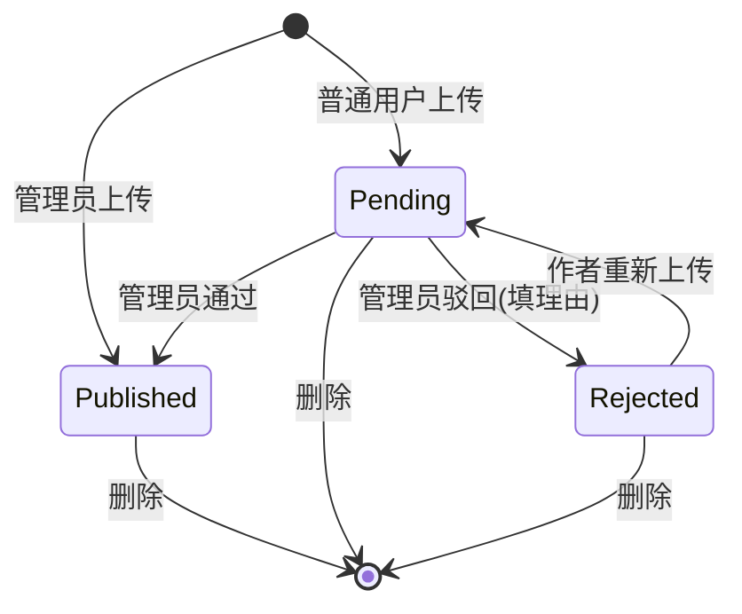

# OpenSkill

[English](./README.md) | 中文

一个自托管的 **[Anthropic Agent Skills](https://docs.claude.com/en/api/agent-sdk/skills)** 管理平台。在一个 Web 应用里完成上传、审核、订阅、下载和在线预览，支持管理员/普通用户角色，数据通过 bind mount 持久化。


## 功能一览

- 📚 **目录浏览** — 全文搜索、分类筛选、标签 chip 筛选，按最新/最多订阅/最多下载/名称排序
- 🔍 **在线预览** — 详情页五个 Tab：Overview（安装命令）/ Preview（SKILL.md 实时渲染）/ Files（可折叠文件树）/ Frontmatter（结构化 JSON）/ Run（服务端执行 → 文件下载）
- 📦 **严格上传校验** — 自动验证 ZIP 结构，提取 `SKILL.md` frontmatter（必含 `name` 和 `description`），可选解析 `manifest.json`，计算 SHA-256
- 👨‍⚖️ **双轨审核流程** — 管理员上传立即发布；普通用户上传进入审核队列，管理员可通过/驳回（带理由）；驳回后作者可改后重传
- ⭐ **订阅 + 下载** — 计数自动维护，含每用户历史
- ▶️ **浏览器内运行** — 含 `scripts/run.js`（Node）或 `scripts/run.py`（Python）的技能可在详情页点 **Run** 由服务端执行，产出的 `.xlsx` / `.docx` / `.pdf` 等文件流回浏览器。Node 运行时预装 `docx` + `exceljs`；Python 运行时预装 `pandas` + `openpyxl` + `python-docx` + `pdfplumber` + `Pillow` + `lxml`
- 🤖 **Agent 模式** — 严格按 Anthropic 原始规范写的声明式 skill（只有 `SKILL.md` + 资源，无 entry 脚本）会被自动识别为 agent 模式：LLM 拿到的不是 `run_skill`，而是 `run_python_code` 工具，**临场写 Python** 操作 skill bundle，产出文件作为 artifact 出现在对话里
- 💬 **对话 + 工具调用** — 在 Chat 里和 LLM（默认 DeepSeek，通过 `LLM_API_KEY` 等任意 OpenAI 兼容端点）聊天，并把可运行/agent 模式的技能挂上对话；LLM 会**真的**调用工具，产出的文件作为可下载的 artifact 出现在消息气泡里——不再有"我把文件放在 artifacts/"的幻觉
- 🛠️ **管理后台** — 审核队列、分类与标签 CRUD、用户列表、统计仪表板
- 🐳 **一键 Docker 部署** — 数据持久化通过 bind mount，重建镜像不丢数据

## 技术栈

| 层 | 选择 |
|---|---|
| 后端 | Fastify 5 + better-sqlite3（WAL 模式，单文件 DB） |
| 前端 | React 19 + Vite 8 + TypeScript + TailwindCSS + Zustand + TanStack Query |
| 认证 | JWT（`@fastify/jwt`）+ bcrypt（rounds=12） |
| Skill 格式 | [Anthropic Agent Skills](https://docs.claude.com/en/api/agent-sdk/skills)：根 `SKILL.md` + 可选 `scripts/` `references/` `assets/`，打包为 ZIP |
| 测试 | `node:test`（Node.js 内建），74 个测试覆盖认证、校验、目录、Node + Python 技能执行、对话工具调用（`run_skill` 与 agent 模式的 `run_python_code`）等 |

## 快速开始（Docker）

```bash
git clone <this-repo> openskill
cd openskill
cp .env.example .env
# 编辑 .env：设置 JWT_SECRET（≥32 个随机字符）和 ADMIN_INITIAL_PASSWORD

docker compose -f docker-compose.deploy.yml up -d --build
# 浏览器打开 http://<host>:8088
```

首次启动会自动创建 `./data/openskill.db`、应用所有 migration、用 `ADMIN_INITIAL_PASSWORD` 创建初始管理员账号 `admin`。

## 本地开发

要求 Node.js 20+。

```bash
# 安装依赖
npm install
npm install --prefix server
npm install --prefix frontend

cp server/.env.example server/.env

# 同时启动前后端
npm run dev
#   后端 API 在 :3000
#   前端 Vite dev server 在 :5173（代理 /api → :3000）

# 运行所有测试
npm test
```

> 如果 3000 端口被占用，用 `PORT=3010 npm run dev:server` 启动后端，并相应修改 `frontend/vite.config.ts` 中的 proxy target。

## 配置

`./.env`（根目录，docker-compose 读取）：

| 变量 | 默认值 | 说明 |
|---|---|---|
| `HOST_PORT` | `8088` | 暴露的宿主机端口（容器内固定 3000） |
| `JWT_SECRET` | _必填_ | ≥32 个随机字符 |
| `ADMIN_INITIAL_PASSWORD` | _必填_ | 仅首次创建 DB 时使用 |
| `ADMIN_INITIAL_USERNAME` | `admin` | 同上 |
| `ADMIN_INITIAL_EMAIL` | `admin@example.com` | 同上 |
| `MAX_UPLOAD_MB` | `20` | ZIP 上传大小上限 |
| `JWT_EXPIRES_IN` | `7d` | JWT 过期时间 |

## Skill 包格式

ZIP 根目录必须有 **`SKILL.md`**，且包含 YAML frontmatter：

```markdown
---
name: pdf-helper
description: Extracts text and metadata from PDF files.
---

# PDF Helper

详细 Markdown 指令写在这里…
```

可选目录结构（下载时原样保留）：

```
my-skill/
├── SKILL.md            # 必需
├── manifest.json       # 可选，AFPS 风格元数据（name/version/...）
├── scripts/            # 可选，Claude 可调用的脚本
├── references/         # 可选，参考文档
└── assets/             # 可选，模板/示例数据
```

如果你 zip 一个目录得到一个外层 wrapper 文件夹（`my-skill/SKILL.md`），服务端会自动识别并剥离。

### 状态机



## 可运行技能（服务端执行）

只要 ZIP 含一个 runner 能识别的入口脚本，技能就变成 **可运行的**：

| 入口                  | 运行时   | 预装库                                                          |
|----------------------|---------|---------------------------------------------------------------|
| `scripts/run.js`     | Node    | `docx`、`exceljs`、`adm-zip`、`js-yaml`（通过 `NODE_PATH`）       |
| `scripts/run.py`     | Python  | `openpyxl`、`pandas`、`python-docx`、`pdfplumber`、`Pillow`、`lxml`（通过 `PYTHONPATH`） |

详情页会出现第 5 个 **Run** Tab：用户在文本框里贴 JSON 输入，点 Run，服务端在隔离的临时目录里执行脚本，产出的文件作为下载流回浏览器。

```
my-skill/
├── SKILL.md
├── manifest.json        # 可选；用 `run` 字段配置执行行为
└── scripts/
    ├── run.js           # Node 入口（默认）
    └── run.py           # Python 入口（备选）
```

如果 `run.js` 与 `run.py` 同时存在，为保持向后兼容会优先使用 Node 入口。

`scripts/run.{js,py}` 的协议：

| 输入                                | 输出                                  |
|-------------------------------------|---------------------------------------|
| `process.env.OPENSKILL_INPUT_FILE`  | `process.env.OPENSKILL_OUTPUT_DIR`    |
| （同时通过 stdin 提供）              | 一个或多个文件（默认上限 50 MB）      |

Runner 用白名单环境变量（`PATH`、`HOME`、`LANG`、`OPENSKILL_INPUT_FILE`、`OPENSKILL_OUTPUT_DIR`，加上 `NODE_PATH` 或 `PYTHONPATH`）spawn 解释器，并预装上表中的库。Node 的额外依赖请把 `node_modules/` 一起塞进 ZIP；Python 的额外依赖暂时需保持精简（自动 `pip install` 暂未实现，规划中）。

脚本正常退出后，runner：

- `OPENSKILL_OUTPUT_DIR` 中 **0 个文件** → 422 `EMPTY_OUTPUT`
- **1 个文件** → 流回浏览器，`Content-Type` 由扩展名推断
- **N 个文件** → 自动打包成单个 `.zip` 流回

`manifest.json` 中可选的 `run` 块用来覆盖默认值：

```json
{
  "name": "csv-cleaner",
  "version": "1.0.0",
  "run": {
    "entry": "scripts/run.py",
    "runtime": "python",
    "timeout_ms": 30000,
    "input_example": { "csv": "name,score\nalice,10\n" }
  }
}
```

`input_example` 会预填 Run Tab 的输入框。`timeout_ms` 在 `[1000, 300000]` 区间夹紧。`runtime` 支持 `node`（默认）和 `python`；省略时也会从 `entry` 的扩展名自动推断。

仓库里 `examples/` 目录下提供了完整可用的示例：

| 示例                            | 运行时  | 演示内容                                              |
|--------------------------------|---------|-------------------------------------------------------|
| `examples/xlsx-generator/`     | Node    | `exceljs`，多行电子表格生成                            |
| `examples/csv-cleaner/`        | Python  | `pandas` + `openpyxl`，CSV → 清洗后的 `.xlsx`         |

打包：

```bash
node scripts/build-examples.js
# → examples/dist/xlsx-generator.zip
# → examples/dist/csv-cleaner.zip
```

通过 UI 上传这些 ZIP 然后点 **Run** 即可试用。

> **并发**：进程级单 flight 锁。当一个运行进行中时，第二个 `/run` 请求直接返回 409 `RUN_BUSY`。这是为单用户/小团队部署设计的，多租户使用前请先加外部沙箱。

> **安全提醒**：当前不做硬隔离（无 seccomp / cgroups / 网络策略），脚本以服务进程同样的 OS 用户运行。**只对你审核过的技能开放运行**。要让陌生人上传可运行技能，请先接 Firecracker / gVisor / Docker-in-Docker 等外部沙箱。

## Agent 模式（声明式技能）

按原始 Anthropic Agent Skill 规范写的技能 —— 只有 `SKILL.md` + 资源，**没有 `scripts/run.{js,py}` entry** —— 在 Run Tab 里跑不起来（没东西可执行），但平台会在它被挂到对话上时自动启用 **agent 模式**：

- LLM 拿到的工具不再是 `run_skill`，而是 `run_python_code`，参数 `{ code: string, stdin?: string }`
- 用户每次发消息时，skill ZIP 会被解压到一个全新的临时目录；LLM 写出来的 `code` 直接用 Python 3 执行，CWD 就是 skill bundle 的根，`scripts/`、模板和资源都在原位
- 预装库 `openpyxl` / `pandas` / `python-docx` / `pdfplumber` / `Pillow` / `lxml` 通过 `PYTHONPATH` 暴露；LibreOffice (`soffice`) 也在 `PATH` 上，可以用来重算公式或做格式转换
- 任何写到 `os.environ['OPENSKILL_OUTPUT_DIR']` 下的文件都会作为 artifact 挂到这条 assistant 消息上 —— 落盘 / 下载链路和普通 Run 路径完全一致

发给 LLM 的 system prompt = skill 的 `SKILL.md` + 一段固定追加内容，明确禁止幻觉文件、要求每个交付物必须来自一次成功的 `run_python_code` 调用。

限制和安全模型与 Run 路径完全一致：默认 60 秒墙钟超时、50 MB 输出上限、1 MB 代码上限、进程级单 flight 锁、无内核级隔离。Agent 模式的对话沿用同一信任假设 —— **只挂载你已审核过的技能**。

## Chat 对话与工具调用

Chat Tab 里可以和 LLM 聊天（默认 DeepSeek，通过 `LLM_API_KEY` / `LLM_API_URL` / `LLM_MODEL` 配置任意 OpenAI 兼容端点），并把一个已发布的技能挂到对话上。当被挂载的技能是**可运行的**，LLM 会决定何时调用它，服务端**真的**执行，产出文件作为 **artifact** 落盘并以下载按钮的形式出现在该条消息下。

```
用户："把这些问题清单导出成 xlsx"
        ↓
LLM 流式响应 → tool_call(run_skill, {input:{filename:..., headers:..., rows:...}})
        ↓
runner 执行 scripts/run.js   ← 真的 Node 子进程，真的 exceljs
        ↓
artifact 落盘到 data/storage/artifacts/{yyyymmdd}/{uuid}.xlsx
        ↓
LLM 继续生成 → "已经为你生成了…"
        ↓
对话 UI 渲染 assistant 文本 + 一个真实的下载 chip
```

### 工具是怎么暴露给 LLM 的

- 一个对话最多挂 0 或 1 个 skill（`PATCH /chat/conversations/:id` body 里 `{skill_id}`）
- 工具暴露**与 skill 模式互斥**：
  - skill 含 `scripts/run.js` 或 `scripts/run.py` → 暴露 `run_skill`，JSON-Schema 来自 `manifest.run.input_schema`，没声明则用 `{type:"object", additionalProperties:true}`
  - skill 只有 `SKILL.md`（agent 模式）→ 暴露 `run_python_code`，参数 `{code: string, stdin?: string}`
- skill 的 `SKILL.md` 内容用作 system prompt，外加一段反幻觉提示，明确告诉模型必须真的调用工具，不能编造文件；agent 模式下还会追加 Python 运行时的使用规则
- 目前只暴露这两个互斥工具，其他工具（web search、code interpreter 等）暂不在范围

### 循环与限制

- 单条用户消息内最多触发 **3** 次 tool_call
- 每次 tool_call 沿用 runner 的限制（默认 60s 超时、50 MB 输出、1 MB 输入、进程级单 flight 锁）
- 失败（`SCRIPT_FAILED`、`TIMEOUT` 等）会作为 tool 结果回喂给 LLM，让它道歉/给建议而不是闷死

### SSE 协议

`POST /api/chat/conversations/:id/messages` 返回 SSE 流：

```
data: {"content": "…"}                               ← 文本增量
data: {"tool_call": {"id":"…","name":"run_skill"}}   ← 模型在调工具
data: {"tool_done": {"filename":"…","content_type":"…","size_bytes":N,"duration_ms":N}}
data: {"tool_error": {"code":"SCRIPT_FAILED","message":"…"}}
data: {"message": {"id":N,"content":"…","artifacts":[{...}]}}  ← 已持久化的最终消息
data: [DONE]
```

### Artifact 持久化

- 文件落在 `data/storage/artifacts/{yyyymmdd}/{uuid}{ext}`，磁盘文件名是不透明的 UUID；显示用的（中文）原始文件名保存在 DB
- `Content-Disposition` 用 RFC 5987（`filename*=UTF-8''<percent-encoded>`）保证非 ASCII 文件名能正确下载
- 删除对话时级联删除 artifact 行，并尽力删除磁盘文件

## 数据持久化（升级前必读）

所有持久化状态都在宿主机的 `./data/` 目录，bind 挂载到容器的 `/app/data`：

```
data/
├── openskill.db          # SQLite 数据库
├── openskill.db-wal      # WAL 日志（SQLite 自动管理）
├── openskill.db-shm      # WAL 共享内存（SQLite 自动管理）
└── storage/
    └── skills/           # 每个 skill 一个 ZIP，文件名 {slug}.zip
```

**重建镜像、拉取新版本、重新创建容器都不会动这个目录。** 只有以下三种情况会丢数据：删除 `./data/`、修改 `docker-compose.deploy.yml` 删掉 bind mount、把 volume 指向不同的宿主机路径。

### 验证升级不丢数据

```bash
# 1. 上传一个 skill，记录 hash
sha256sum data/openskill.db

# 2. 强制完整重建
docker compose -f docker-compose.deploy.yml down
docker compose -f docker-compose.deploy.yml build --no-cache
docker compose -f docker-compose.deploy.yml up -d

# 3. hash 仍应一致（或只有 WAL 簿记差异）
sha256sum data/openskill.db

# 浏览器重新登录，skill 还在，SHA-256 完整匹配
```

### 数据库迁移

`server/src/migrate.js` 在启动时运行，扫描 `server/sql/NNN_*.sql` 文件按顺序应用，记录到 `migrations` 表。已应用过的会跳过——所以重启容器是安全的。

新增 schema 变更：在 `server/sql/` 加一个新文件 `003_my_change.sql`，重建并重启即可。下次启动日志会显示 `migrations: applied=1 skipped=2`。

## 备份与恢复

运行 `scripts/backup.sh` 快照 DB + storage：

```bash
./scripts/backup.sh                 # 写入 ./backups/
./scripts/backup.sh /mnt/usb/bk     # 自定义目录
```

脚本使用 SQLite 在线 `.backup` API（运行中可安全调用）+ tar.gz 打包 storage。

恢复流程：

```bash
docker compose -f docker-compose.deploy.yml down
cp backups/openskill-20260521-220000.db data/openskill.db
tar -xzf backups/storage-20260521-220000.tar.gz -C data/
docker compose -f docker-compose.deploy.yml up -d
```

## 端到端验证清单

升级后逐项验证：

1. ☐ 浏览器访问 http://localhost:8088 — 落地页正常加载
2. ☐ 注册新用户 `alice`
3. ☐ 用 `admin` 登录，创建分类 "Productivity" 和标签 "writing"
4. ☐ 以 admin 身份在 Upload 页上传一个合法 skill ZIP → status `published`
5. ☐ Catalog 显示该 skill；分类、标签筛选正确
6. ☐ 点进详情 → 四个内容 Tab 都正常渲染（Overview / Preview / Files / Frontmatter）；复制安装命令；如果该 skill 是可运行的，还会出现第 5 个 **Run** Tab
7. ☐ 订阅（计数 +1）→ 退订 → 再订阅
8. ☐ 点击 Download → 文件 SHA-256 与上传时一致
9. ☐ 登出，以 `alice` 登录上传另一个 ZIP → status `pending`
10. ☐ 管理员审核队列看到该 skill。带理由驳回。
11. ☐ `alice` 在「我的上传」看到 "rejected" 与理由。重传修复后的 ZIP → 状态回到 `pending`
12. ☐ 管理员通过 → catalog 显示
13. ☐ 统计页显示正确的总数和 Top 列表
14. ☐ `docker compose down && docker compose build && up -d` — 重新登录，所有数据完整

## API 接口

```
POST   /auth/register
POST   /auth/login
GET    /auth/me

GET    /skills                         # 列表（q, category, tag, sort, page, limit, status?）
GET    /skills/:slug                   # 详情
GET    /skills/:slug/preview           # SKILL.md + file_tree + frontmatter + manifest
POST   /skills                         # 上传（multipart：file, slug?, categorySlug?, tagSlugs?）
PUT    /skills/:slug                   # 重新上传（作者或管理员）
DELETE /skills/:slug                   # 删除（作者或管理员）
GET    /skills/:slug/download          # 下载 ZIP，计数 +1
POST   /skills/:slug/run                # body: { input }；流回产出的文件
POST   /skills/:slug/subscribe
DELETE /skills/:slug/subscribe
GET    /skills/:slug/subscription      # { subscribed: bool }

GET    /me/subscriptions
GET    /me/uploads

GET    /categories                     # 公开
GET    /categories/:slug
POST   /admin/categories               # 管理员
PATCH  /admin/categories/:slug
DELETE /admin/categories/:slug
GET    /tags
POST   /admin/tags
PATCH  /admin/tags/:slug
DELETE /admin/tags/:slug

POST   /admin/skills/:slug/approve
POST   /admin/skills/:slug/reject      # body: { reason }
GET    /admin/stats
GET    /admin/users

GET    /chat/conversations
POST   /chat/conversations             # body: { skill_id? }
PATCH  /chat/conversations/:id         # body: { skill_id?, title? }
DELETE /chat/conversations/:id         # 级联删除消息 + artifacts（DB 与磁盘）
GET    /chat/conversations/:id/messages
POST   /chat/conversations/:id/messages  # body: { content }；SSE 流
GET    /chat/artifacts/:id/download    # 仅 owner

GET    /health                         # { ok, db, ts }
```

所有错误统一返回 `{ error, code, detail? }`，错误码列表见 `server/src/errors.js`。

## 目录结构

```
openskill/
├── docker-compose.deploy.yml   # 生产部署（bind mount ./data）
├── docker-compose.yml          # 本地开发
├── Dockerfile                  # 多阶段：frontend + server + runtime
├── package.json                # 根级脚本（dev/build/test）
├── README.md                   # 英文版
├── README.zh-CN.md             # 本文件
├── data/                       # ⚠️ 运行时状态（gitignored）
├── examples/                   # 可运行示例技能（xlsx-generator 等）
│   └── README.md               # runnable-skill 协议参考
├── scripts/
│   ├── backup.sh               # SQLite 在线备份 + storage 打包
│   └── build-examples.js       # 把 examples/<skill>/ 打包到 examples/dist/<skill>.zip
├── server/                     # Fastify + better-sqlite3
│   ├── src/                    # 入口、db、auth、validators、skill-runner、routes/*
│   ├── sql/                    # 顺序编号的 SQL 迁移
│   └── test/                   # node:test 测试套件（74 个）
└── frontend/                   # React + Vite SPA
    └── src/
        ├── components/         # MainLayout、Toast、SkillMarkdown、FileTree
        ├── views/              # 13 个视图组件
        ├── store.ts            # Zustand
        ├── domain.ts           # 共享类型
        └── utils/api.ts        # fetch 封装、downloadFile
```

## 许可证

MIT
