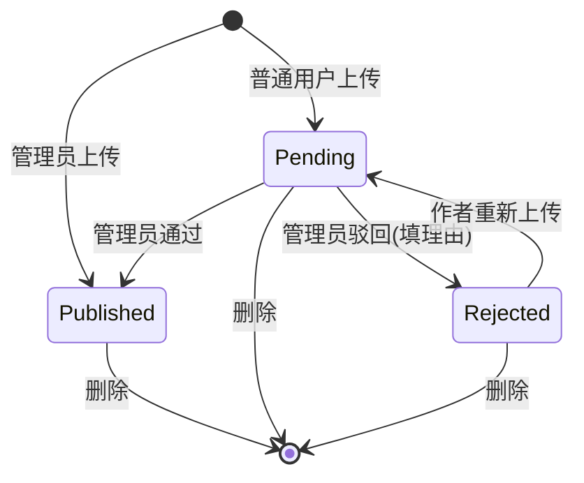

# OpenSkill

[English](./README.md) | 中文

一个自托管的 **[Anthropic Agent Skills](https://docs.claude.com/en/api/agent-sdk/skills)** 管理平台。在一个 Web 应用里完成上传、审核、订阅、下载和在线预览，支持管理员/普通用户角色，数据通过 bind mount 持久化。


## 功能一览

- 📚 **目录浏览** — 全文搜索、分类筛选、标签 chip 筛选，按最新/最多订阅/最多下载/名称排序
- 🔍 **在线预览** — 详情页五个 Tab：Overview（安装命令）/ Preview（SKILL.md 实时渲染）/ Files（可折叠文件树）/ Frontmatter（结构化 JSON）/ Run（服务端执行 → 文件下载）
- 📦 **严格上传校验** — 自动验证 ZIP 结构，提取 `SKILL.md` frontmatter（必含 `name` 和 `description`），可选解析 `manifest.json`，计算 SHA-256
- 👨‍⚖️ **双轨审核流程** — 管理员上传立即发布；普通用户上传进入审核队列，管理员可通过/驳回（带理由）；驳回后作者可改后重传
- ⭐ **订阅 + 下载** — 计数自动维护，含每用户历史
- ▶️ **浏览器内运行** — 含 `scripts/run.js` 的技能可在详情页点 **Run** 由服务端执行，产出的 `.xlsx` / `.docx` / `.pdf` 等文件流回浏览器；服务端预装 `docx` 和 `exceljs`
- 🛠️ **管理后台** — 审核队列、分类与标签 CRUD、用户列表、统计仪表板
- 🐳 **一键 Docker 部署** — 数据持久化通过 bind mount，重建镜像不丢数据

## 技术栈

| 层 | 选择 |
|---|---|
| 后端 | Fastify 5 + better-sqlite3（WAL 模式，单文件 DB） |
| 前端 | React 19 + Vite 8 + TypeScript + TailwindCSS + Zustand + TanStack Query |
| 认证 | JWT（`@fastify/jwt`）+ bcrypt（rounds=12） |
| Skill 格式 | [Anthropic Agent Skills](https://docs.claude.com/en/api/agent-sdk/skills)：根 `SKILL.md` + 可选 `scripts/` `references/` `assets/`，打包为 ZIP |
| 测试 | `node:test`（Node.js 内建），43 个测试覆盖认证、校验、目录、服务端技能执行等 |

## 快速开始（Docker）

```bash
git clone <this-repo> openskill
cd openskill
cp .env.example .env
# 编辑 .env：设置 JWT_SECRET（≥32 个随机字符）和 ADMIN_INITIAL_PASSWORD

docker compose -f docker-compose.deploy.yml up -d --build
# 浏览器打开 http://<host>:8088
```

首次启动会自动创建 `./data/openskill.db`、应用所有 migration、用 `ADMIN_INITIAL_PASSWORD` 创建初始管理员账号 `admin`。

## 本地开发

要求 Node.js 20+。

```bash
# 安装依赖
npm install
npm install --prefix server
npm install --prefix frontend

cp server/.env.example server/.env

# 同时启动前后端
npm run dev
#   后端 API 在 :3000
#   前端 Vite dev server 在 :5173（代理 /api → :3000）

# 运行所有测试
npm test
```

> 如果 3000 端口被占用，用 `PORT=3010 npm run dev:server` 启动后端，并相应修改 `frontend/vite.config.ts` 中的 proxy target。

## 配置

`./.env`（根目录，docker-compose 读取）：

| 变量 | 默认值 | 说明 |
|---|---|---|
| `HOST_PORT` | `8088` | 暴露的宿主机端口（容器内固定 3000） |
| `JWT_SECRET` | _必填_ | ≥32 个随机字符 |
| `ADMIN_INITIAL_PASSWORD` | _必填_ | 仅首次创建 DB 时使用 |
| `ADMIN_INITIAL_USERNAME` | `admin` | 同上 |
| `ADMIN_INITIAL_EMAIL` | `admin@example.com` | 同上 |
| `MAX_UPLOAD_MB` | `20` | ZIP 上传大小上限 |
| `JWT_EXPIRES_IN` | `7d` | JWT 过期时间 |

## Skill 包格式

ZIP 根目录必须有 **`SKILL.md`**，且包含 YAML frontmatter：

```markdown
---
name: pdf-helper
description: Extracts text and metadata from PDF files.
---

# PDF Helper

详细 Markdown 指令写在这里…
```

可选目录结构（下载时原样保留）：

```
my-skill/
├── SKILL.md            # 必需
├── manifest.json       # 可选，AFPS 风格元数据（name/version/...）
├── scripts/            # 可选，Claude 可调用的脚本
├── references/         # 可选，参考文档
└── assets/             # 可选，模板/示例数据
```

如果你 zip 一个目录得到一个外层 wrapper 文件夹（`my-skill/SKILL.md`），服务端会自动识别并剥离。

### 状态机



## 可运行技能（服务端执行）

当 ZIP 包含 Node.js 入口脚本（默认 `scripts/run.js`），技能就变成 **可运行的**。详情页会出现第 5 个 **Run** Tab：用户在文本框里贴 JSON 输入，点 Run，服务端在隔离的临时目录里执行脚本，产出的文件作为下载流回浏览器。

```
my-skill/
├── SKILL.md
├── manifest.json        # 可选；用 `run` 字段配置执行行为
└── scripts/
    └── run.js           # 默认入口
```

`scripts/run.js` 的协议：

| 输入                                | 输出                                  |
|-------------------------------------|---------------------------------------|
| `process.env.OPENSKILL_INPUT_FILE`  | `process.env.OPENSKILL_OUTPUT_DIR`    |
| （同时通过 stdin 提供）              | 一个或多个文件（默认上限 50 MB）      |

Runner 用白名单环境变量（`PATH`、`HOME`、`LANG`、`OPENSKILL_INPUT_FILE`、`OPENSKILL_OUTPUT_DIR`、`NODE_PATH`）spawn `node`，并通过 `NODE_PATH` **预装 `docx` + `exceljs`**，所以可运行技能可以直接 `require('docx')` 或 `require('exceljs')`，无需打包。其他依赖请把 `node_modules/` 一起塞进 ZIP。

脚本正常退出后，runner：

- `OPENSKILL_OUTPUT_DIR` 中 **0 个文件** → 422 `EMPTY_OUTPUT`
- **1 个文件** → 流回浏览器，`Content-Type` 由扩展名推断
- **N 个文件** → 自动打包成单个 `.zip` 流回

`manifest.json` 中可选的 `run` 块用来覆盖默认值：

```json
{
  "name": "xlsx-generator",
  "version": "1.0.0",
  "run": {
    "entry": "scripts/run.js",
    "runtime": "node",
    "timeout_ms": 30000,
    "input_example": { "sheetName": "Demo", "rows": [["a", "b"]] }
  }
}
```

`input_example` 会预填 Run Tab 的输入框。`timeout_ms` 在 `[1000, 300000]` 区间夹紧。目前只支持 `node` 运行时。

仓库里 `examples/xlsx-generator/` 是一个完整可用的示例。打包：

```bash
node scripts/build-examples.js
# → examples/dist/xlsx-generator.zip
```

通过 UI 上传这个 ZIP 然后点 **Run** 即可试用。

> **并发**：进程级单 flight 锁。当一个运行进行中时，第二个 `/run` 请求直接返回 409 `RUN_BUSY`。这是为单用户/小团队部署设计的，多租户使用前请先加外部沙箱。

> **安全提醒**：当前不做硬隔离（无 seccomp / cgroups / 网络策略），脚本以服务进程同样的 OS 用户运行。**只对你审核过的技能开放运行**。要让陌生人上传可运行技能，请先接 Firecracker / gVisor / Docker-in-Docker 等外部沙箱。

## 数据持久化（升级前必读）

所有持久化状态都在宿主机的 `./data/` 目录，bind 挂载到容器的 `/app/data`：

```
data/
├── openskill.db          # SQLite 数据库
├── openskill.db-wal      # WAL 日志（SQLite 自动管理）
├── openskill.db-shm      # WAL 共享内存（SQLite 自动管理）
└── storage/
    └── skills/           # 每个 skill 一个 ZIP，文件名 {slug}.zip
```

**重建镜像、拉取新版本、重新创建容器都不会动这个目录。** 只有以下三种情况会丢数据：删除 `./data/`、修改 `docker-compose.deploy.yml` 删掉 bind mount、把 volume 指向不同的宿主机路径。

### 验证升级不丢数据

```bash
# 1. 上传一个 skill，记录 hash
sha256sum data/openskill.db

# 2. 强制完整重建
docker compose -f docker-compose.deploy.yml down
docker compose -f docker-compose.deploy.yml build --no-cache
docker compose -f docker-compose.deploy.yml up -d

# 3. hash 仍应一致（或只有 WAL 簿记差异）
sha256sum data/openskill.db

# 浏览器重新登录，skill 还在，SHA-256 完整匹配
```

### 数据库迁移

`server/src/migrate.js` 在启动时运行，扫描 `server/sql/NNN_*.sql` 文件按顺序应用，记录到 `migrations` 表。已应用过的会跳过——所以重启容器是安全的。

新增 schema 变更：在 `server/sql/` 加一个新文件 `003_my_change.sql`，重建并重启即可。下次启动日志会显示 `migrations: applied=1 skipped=2`。

## 备份与恢复

运行 `scripts/backup.sh` 快照 DB + storage：

```bash
./scripts/backup.sh                 # 写入 ./backups/
./scripts/backup.sh /mnt/usb/bk     # 自定义目录
```

脚本使用 SQLite 在线 `.backup` API（运行中可安全调用）+ tar.gz 打包 storage。

恢复流程：

```bash
docker compose -f docker-compose.deploy.yml down
cp backups/openskill-20260521-220000.db data/openskill.db
tar -xzf backups/storage-20260521-220000.tar.gz -C data/
docker compose -f docker-compose.deploy.yml up -d
```

## 端到端验证清单

升级后逐项验证：

1. ☐ 浏览器访问 http://localhost:8088 — 落地页正常加载
2. ☐ 注册新用户 `alice`
3. ☐ 用 `admin` 登录，创建分类 "Productivity" 和标签 "writing"
4. ☐ 以 admin 身份在 Upload 页上传一个合法 skill ZIP → status `published`
5. ☐ Catalog 显示该 skill；分类、标签筛选正确
6. ☐ 点进详情 → 四个内容 Tab 都正常渲染（Overview / Preview / Files / Frontmatter）；复制安装命令；如果该 skill 是可运行的，还会出现第 5 个 **Run** Tab
7. ☐ 订阅（计数 +1）→ 退订 → 再订阅
8. ☐ 点击 Download → 文件 SHA-256 与上传时一致
9. ☐ 登出，以 `alice` 登录上传另一个 ZIP → status `pending`
10. ☐ 管理员审核队列看到该 skill。带理由驳回。
11. ☐ `alice` 在「我的上传」看到 "rejected" 与理由。重传修复后的 ZIP → 状态回到 `pending`
12. ☐ 管理员通过 → catalog 显示
13. ☐ 统计页显示正确的总数和 Top 列表
14. ☐ `docker compose down && docker compose build && up -d` — 重新登录，所有数据完整

## API 接口

```
POST   /auth/register
POST   /auth/login
GET    /auth/me

GET    /skills                         # 列表（q, category, tag, sort, page, limit, status?）
GET    /skills/:slug                   # 详情
GET    /skills/:slug/preview           # SKILL.md + file_tree + frontmatter + manifest
POST   /skills                         # 上传（multipart：file, slug?, categorySlug?, tagSlugs?）
PUT    /skills/:slug                   # 重新上传（作者或管理员）
DELETE /skills/:slug                   # 删除（作者或管理员）
GET    /skills/:slug/download          # 下载 ZIP，计数 +1
POST   /skills/:slug/run                # body: { input }；流回产出的文件
POST   /skills/:slug/subscribe
DELETE /skills/:slug/subscribe
GET    /skills/:slug/subscription      # { subscribed: bool }

GET    /me/subscriptions
GET    /me/uploads

GET    /categories                     # 公开
GET    /categories/:slug
POST   /admin/categories               # 管理员
PATCH  /admin/categories/:slug
DELETE /admin/categories/:slug
GET    /tags
POST   /admin/tags
PATCH  /admin/tags/:slug
DELETE /admin/tags/:slug

POST   /admin/skills/:slug/approve
POST   /admin/skills/:slug/reject      # body: { reason }
GET    /admin/stats
GET    /admin/users

GET    /health                         # { ok, db, ts }
```

所有错误统一返回 `{ error, code, detail? }`，错误码列表见 `server/src/errors.js`。

## 目录结构

```
openskill/
├── docker-compose.deploy.yml   # 生产部署（bind mount ./data）
├── docker-compose.yml          # 本地开发
├── Dockerfile                  # 多阶段：frontend + server + runtime
├── package.json                # 根级脚本（dev/build/test）
├── README.md                   # 英文版
├── README.zh-CN.md             # 本文件
├── data/                       # ⚠️ 运行时状态（gitignored）
├── examples/                   # 可运行示例技能（xlsx-generator 等）
│   └── README.md               # runnable-skill 协议参考
├── scripts/
│   ├── backup.sh               # SQLite 在线备份 + storage 打包
│   └── build-examples.js       # 把 examples/<skill>/ 打包到 examples/dist/<skill>.zip
├── server/                     # Fastify + better-sqlite3
│   ├── src/                    # 入口、db、auth、validators、skill-runner、routes/*
│   ├── sql/                    # 顺序编号的 SQL 迁移
│   └── test/                   # node:test 测试套件（43 个）
└── frontend/                   # React + Vite SPA
    └── src/
        ├── components/         # MainLayout、Toast、SkillMarkdown、FileTree
        ├── views/              # 13 个视图组件
        ├── store.ts            # Zustand
        ├── domain.ts           # 共享类型
        └── utils/api.ts        # fetch 封装、downloadFile
```

## 许可证

MIT
